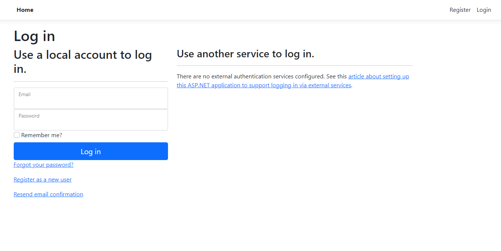

# CMPG-323-Project-3---37280287

# Link to Web App
[EcoPowerLogistics](https://ecopowerlogistics20230916173634.azurewebsites.net)

# SuperStore Web Application

The SuperStore web application is a sample project that demonstrates the use of the Repository Pattern, CRUD (Create, Read, Update, Delete) operations, and principles of S.O.L.I.D design in an ASP.NET Core MVC application.

## Table of Contents

- [Overview](#overview)
- [Features](#features)

## Overview

The SuperStore web application is designed to manage customers, orders, and products. It utilizes best practices in software architecture and design patterns to provide a structured and maintainable codebase. Key features include:

- **Repository Pattern**: The project employs the Repository Pattern to abstract data access and ensure separation of concerns.

- **CRUD Operations**: Demonstrates Create, Read, Update, and Delete operations for customers, orders, and products.

- **Dependency Injection**: Utilizes Dependency Injection for loose coupling and easy testability.

- **Entity Framework Core**: Data persistence is achieved using Entity Framework Core, a powerful Object-Relational Mapping (ORM) framework.

- **S.O.L.I.D Principles**: The code adheres to S.O.L.I.D design principles, promoting scalability and maintainability.

## Features

- **Customers Management**: Allows you to add, view, edit, and delete customer records.

- **Orders Management**: Provides functionality to create, view, edit, and delete order records, including order details.

- **Products Management**: Offers the ability to manage product information, including adding, viewing, editing, and deleting products.

## How the Web App Works?
- First, navigate to the website: [EcoPowerLogistics](https://ecopowerlogistics20230916173634.azurewebsites.net) then you will see the following:
  
- Click on the register/login hyperlink located at the top right:
  
- When you have successfully registered and logged in, you will see: Home, Customers, Orders, and Products tabs.
  
- When you have clicked on one of the tabs, you will see a table related to the connected database.
- You can create a new item in that particular table by clicking on create new hyperlink located at the top of the page.
- You can also edit existing entries, by clicking edit to the right hand side of the entry and then editing the values in the edits.
- You can also delete existing entries, by clicking on the delete button on the right hand side of the entries
